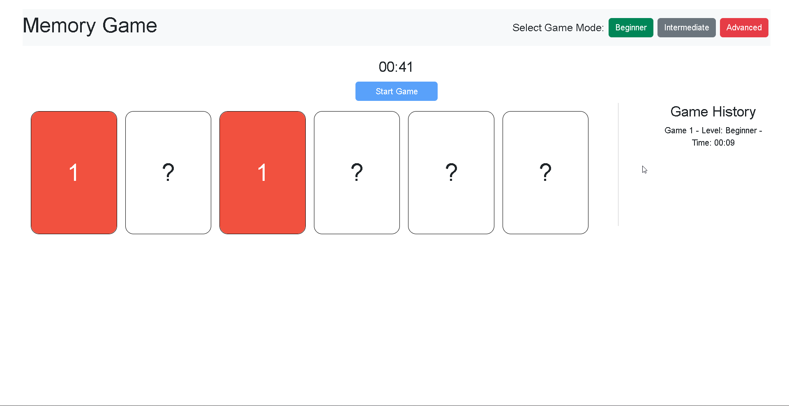

# Memory Game

This memory game utilizes Blazor's state management for users to flip and match cards. The objective is to match every
card given the number and color of the cards. It provides a game history list showing which difficulty was selected and
how long it took to win that game. 



## Features

- 3 game modes (beginner, intermediate and advanced)
- Timed games with a game history to show which game mode was played and how long it took to complete it
- Cards cannot be flipped until "Start Game" has been clicked

## Known Issues

> [!Caution]  
> Clicking the cards too fast will break the game!

## Getting Started

### Running the app

1. **Clone the repository:**

   ```bash
   git clone https://github.com/andymartinez1/MemoryGame.git
   ```

2. **Navigate to the project directory:**

   ```bash
   cd MemoryGame
   ```

3. **Restore dependencies:**

   ```bash
   dotnet restore
   ```

4. Build and run the app:
   ```bash
   dotnet build
   dotnet run
   ```

## Tech Stack

- ASP.NET Blazor
- .NET 10
